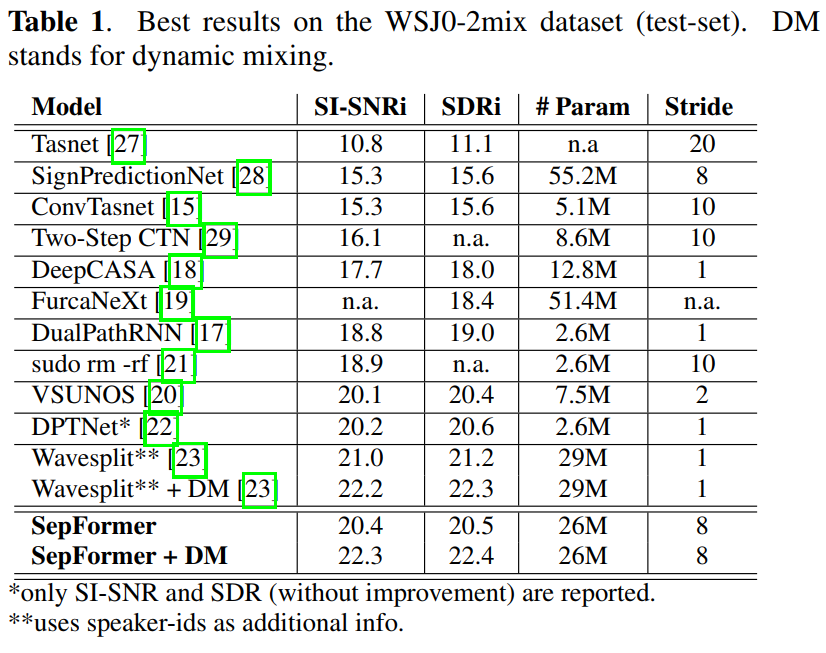
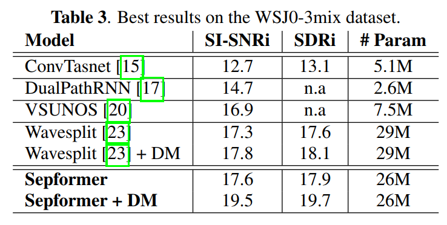

# SepFormer

## Introduction

RNNs are a crucial component of modern audio processing systems and are used in many different domains like speech recognition, synthesis, enhancement, and separation. However, the lack of parallelization in their computations can act as a bottleneck to model performance and computation time.

Transformers are emerging as a natural alternative to standard RNNs, replacing recurrent computations with a multi-head attention mechanism that makes them more efficient due to parallelization. Transformers are designed to handle sequential input data (e.g. natural language). However, unlike RNNs, transformers do not necessarily process the data in order. The *attention* mechanism provides context for any position in the input sequence, thus providing better short- and long-term modelling.

**SepFormer** is a Transformer-based neural network for speech separation. Audio separation is performed by estimating a masking ("cancelling") clip for each source audio clip in this learned-domain. The masking clip cancels out specific sounds in the time-domain mixture-signal (linear sample representation of audio) when the clip vectors are multiplied together. Better long-term modelling is crucial, so SepFormer is mainly composed of multi-head attention and feedforward layers.

## Model Structure

SepFormer consists of
- an encoder block which estimates a learned-representation for the input signal, 
- a masking network which estimates optimal masks to separate the sources present in the mixtures, and 
- a decoder which reconstructs the estimated sources in the time domain using the masks provided by the masking network. 

A high level diagram of SepFormer:

### Encoder

- The encoder takes in a time-domain mixture-signal (to represent mixed source, raw audio), and uses a representation similar to a short-time Fourier transform using a single convolutional layer:

    - h = ReLU(conv1d(x))

- The encoder is an essential part because self-attention has quadratic complexity with respect to the length of the input vector, so a more efficient data representation is needed.

- More specifically, it is based on 256 convolutional filters with a kernel size of 16 samples and a stride factor of 8 samples (The same kernel size and stride factor as the decoder).

### Masking Network

- The masking network is fed with this encoded representation (previously denoted h) and estimates a mask for each of the speakers in the mixture

- The encoded input h is then normalized with layer normalization and processed by a linear layer

- A chunking operation is performed, splitting the input at fixed time intervals and putting them in parallel

- The SepFormer block is designed to model both short and long-term dependencies with the dual scale approach of dual-path RNNs

- The IntraTransformer block models short-term dependencies and the InterTransformer block models longer-term dependencies

- The OverlapAdd block practically undoes the chunking operation

- In the best models, the SepFormer masking network processes chunks of size C = 250 with a 50% overlap between them and employs K = 8 layers of transformers in both the IntraTransformer and InterTransformer blocks. The IntraT-InterT dual-path processing pipeline is repeated N = 2 times. 8 parallel attention heads were used, and 1024-dimensional feedforward networks used within each transformer layer.

### Decoder

- Simply uses a transposed CNN layer with the same stride and kernel size of the encoder

- The input to the decoder is the element-wise multiplication between the mask mk of the source k

The Adam algorithm was used as the model optimizer, with a learning rate of 15×10-5. After epoch 65 (or epoch 100 with dynamic mixing), the learning rate is halved if no improvement of the validation performance is observed after 3 consecutive epochs (or 5 epochs with dynamic mixing). During training, a batch size of 1 was used. The system is trained for a maximum of 200 epochs.

## Data Processing

### Dataset

https://paperswithcode.com/datasets?task=audio-source-separation

WSJ0-2mix and WSJ0-3mix datasets, 30 hours of train data, 10 hours of validation data, 5 hours of test data

In the WSJ0-2mix and WSJ0-3mix datasets, mixtures of two speakers and three speakers are created by randomly mixing utterances in the WSJ0 corpus of machine-read Wall Street Journal news text. The waveforms are sampled at 8 kHz

### Data Augmentation

The authors explored the use of dynamic mixing data augmentation, consisting of the creation of new mixtures from single speaker sources. Also, they expanded this powerful technique by applying a random speed perturbation before mixing them. The speed randomly changes between 95% and 105% the original speed.

## Evaluation Metrics & Performance

On the WSJ0-2mix dataset, SepFormer achieves an SI-SNR improvement of 22.3 dB and a Signal-to-Distortion Ratio improvement of 22.4 dB on the test-set with dynamic mixing.

SepFormer obtains state-of-the-art performance with an SI-SNRi of 19.5 dB and an SDRi of 19.7 dB

A great advantage of SepFormer over other RNN-based systems is the possibility to parallelize the computations over different time steps, leading to faster training and inference.

## Tools & Libraries 

The exact tools or libraries used to build SepFormer are not specified and are not necessary as there is enough information to replicate the model with any appropriate platform. Presumably, it is built with Python and the PyTorch library by analyzing its dependencies.

## Additional Resources

SepFormer Paper: "Attention is all you need in speech separation" https://arxiv.org/pdf/2010.13154.pdf

SepFormer presentation for ICASSP 2021 https://www.youtube.com/watch?v=S5ZTc5jmpfI