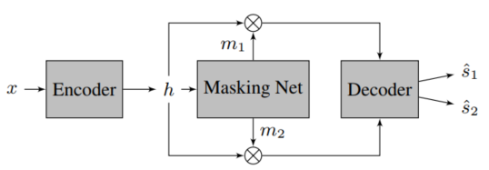
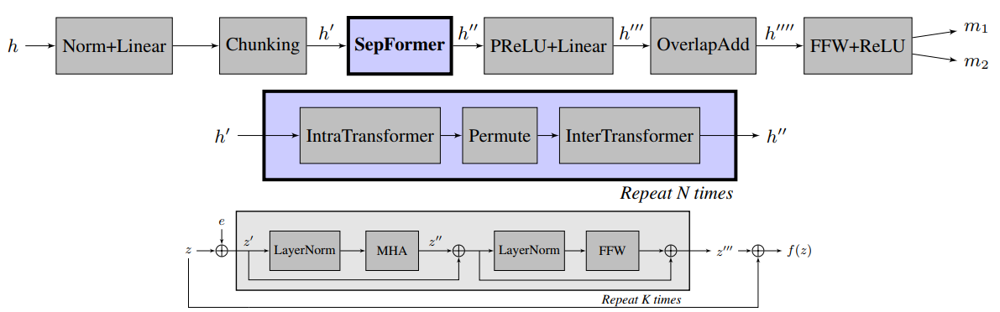
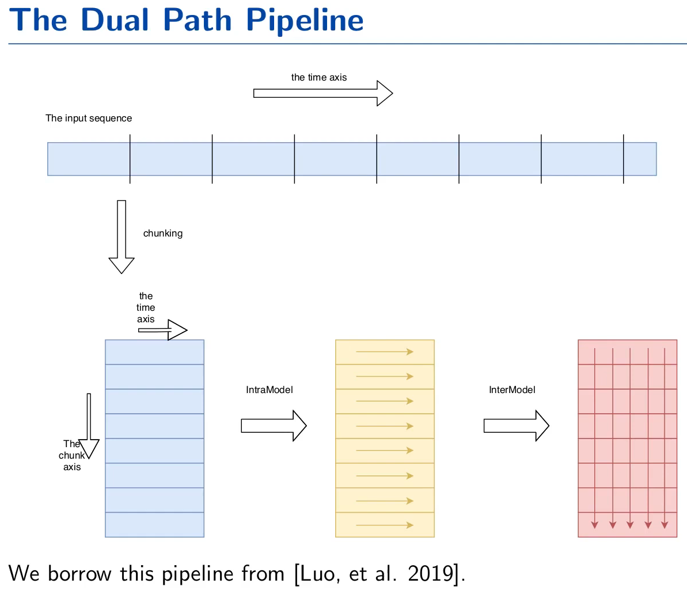

# SepFormer

## Introduction

RNNs are a crucial component of modern audio processing systems and are used in many different domains like speech recognition, synthesis, enhancement, and separation. However, the lack of parallelization in their computations can act as a bottleneck to model performance and computation time.

Transformers are emerging as a natural alternative to standard RNNs, replacing recurrent computations with a multi-head attention mechanism that makes them more efficient due to parallelization. Transformers are designed to handle sequential input data (e.g. natural language). However, unlike RNNs, transformers do not necessarily process the data in order. The *attention* mechanism provides context for any position in the input sequence, thus providing better short- and long-term modelling.

**SepFormer** is a Transformer-based neural network for speech separation. Audio separation is performed by estimating a masking ("cancelling") clip for each source audio clip in this learned-domain. The masking clip cancels out specific sounds in the time-domain mixture-signal (linear sample representation of audio) when the clip vectors are multiplied together. Better long-term modelling is crucial, so SepFormer is mainly composed of multi-head attention and feedforward layers.

## Model Structure

SepFormer consists of
- an encoder block which estimates a learned-representation for the input signal, 
- a masking network which estimates optimal masks to separate the sources present in the mixtures, and 
- a decoder which reconstructs the estimated sources in the time domain using the masks provided by the masking network. 

A high level diagram of SepFormer:

A more detailed diagram:

### Encoder

- The encoder takes in a time-domain mixture-signal (to represent mixed source, raw audio), and uses a representation similar to a short-time Fourier transform using a single convolutional layer:

    - <math>h = ReLU(conv1d(x))</math>

- The encoder is an essential part because self-attention has quadratic complexity with respect to the length of the input vector, so a more efficient data representation is needed.

### Masking Network

- The masking network is fed with this encoded representation (previously denoted <math>h</math>) and estimates a mask for each of the speakers in the mixture

- The encoded input <math>h</math> is then normalized with layer normalization and processed by a linear layer

- A chunking operation is performed, splitting the input at fixed time intervals and putting them in parallel

- The SepFormer block is designed to model both short and long-term dependencies with the dual scale approach of dual-path RNNs

- The IntraTransformer block models short-term dependencies and the InterTransformer block models longer-term dependencies

- The OverlapAdd block practically undoes the chunking operation

### Decoder

- Simply uses a transposed CNN layer with the same stride and kernel size of the encoder

- The input to the decoder is the element-wise multiplication between the mask <i class="math">mk</i> of the source <i class="math">k</i>

## Data Processing

### Dataset

https://paperswithcode.com/datasets?task=audio-source-separation

WSJ0-2mix and WSJ0-3mix datasets, 30 hours of train data, 10 hours of validation data, 5 hours of test data

In the WSJ0-2mix and WSJ0-3mix datasets, mixtures of two speakers and three speakers are created by randomly mixing utterances in the WSJ0 corpus of machine-read Wall Street Journal news text. The waveforms are sampled at 8 kHz

SepFormer achieves an SI-SNRi of 22.3 dB on the WSJ0-2mix dataset and SOTA performance of 19.5 dB SI-SNRi on the WSJ0-3mix dataset.

## Evaluation Metrics & Performance

- Processes all time steps in parallel and still achieves competitive performance when downsampling the encoded representation by a factor of 8

## Tools & Libraries 

## Additional Resources

SepFormer presentation for ICASSP 2021 https://www.youtube.com/watch?v=S5ZTc5jmpfI

SepFormer Paper: "Attention is all you need in speech separation" https://arxiv.org/pdf/2010.13154.pdf