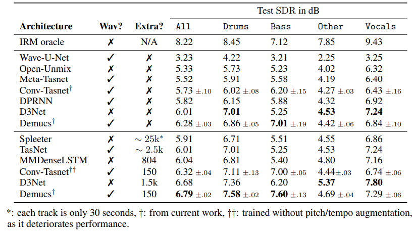

# Demucs

## Model Structure

a) (left) mix waveform as input, 4 source estimate as output. Arrows are U-net connections

b) (right) detailed view of the decoder (top) and encoder(bottom), Cin & Cout are # of input/output channels, K is kernel size, and S is stride

### Details:
 - [Full paper and architecture description](https://hal.archives-ouvertes.fr/hal-02379796/document)
 - An extension of the Conv-Tasnet architecture
 - Simple L1 loss is used
 - skip connections between encoder and decoder blocks showed empirical performance boosts

### Arhcitecture Features:
 - Directly operates on the raw input waveform and generates a waveform for each source
 - Inspired by models for music synthesis rather than spectrum masking approaches
 - Adapts the Conv-Tasnet architecture - it is a U-net architecture with convolutional encoder an decoder
 - bidirectional LSTM (long short-term memory) b/w the encoder and decoder
 - Uses stereo (2-channels) input and outputs stereo

---

## Data Processing
 - Songs are given as input as their waveform
 - Songs are split up into smaller chunks (2-8 seconds)
 - extra input variation:
     - source shuffling
     - random scaling
     - pitch/tempo shifting
 - MusDB has 150 songs with full supervission in stereo and sampled in 44.1kHz

---

## Dataset
 - MusDB dataset + 150 extra songs

---

## Evaluation Metrics & Performance

 - Common stem (source contribution) categories:
    1. drums
    2. bass
    3. other
    4. vocals
 - Surpasses all existing spectrogram and waveform domain architectures in terms of SDR (Signal to Distortion Ratio)
    - 6.3 points of SDR (without extra training data) as opposed to 6.0 by the next best method
    - up to 6.8 SDR with extra training data
    - Even outperforms the IRM (Ideal Ratio Mask) oracle in bass source (7.6 vs 7.1 SDR)
 - Model size is much larger than other techniques (~1GB vs ~50MB) - lossless quantization compression is able to reduce this to ~150MB

---

## Tools & Libraries 
 - Python
 - pyTorch, numpy, julius (pyTorch based digital signal processing for audio)
 - ffmpeg, torchaudio, musdb, museval
 - diffQ for quantization (compression)