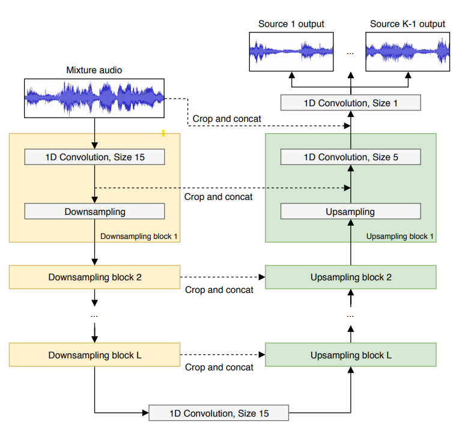
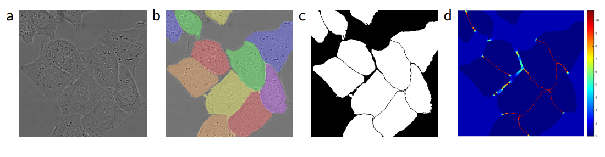

# Wave-U-Net

## Model Structure

This model is built off of the [U-Net](https://en.wikipedia.org/wiki/U-Net) architecture.

- CNN
- An *encoder*, followed by a *decoder*.
- Encoder
  - Successive downsampling to encode the input into feature representations of the original input.
- Decoder
  - Project the features back into a longer tensor (upscale).
-  What is the purpose of this method?
   -  To create a full size output generated from the features learned from the input.

---

U-Net CNNs were proposed originally for biomedical image segmentation. In the reference paper, an unsegmented image of cells is used as input to the model $(a)$. This is passed through the encoder, creating features relating to the image segmentation. After decoding/upscaling, a segmentation mask is created from the model output $(c)$. Training is done by overlaying the ground truth/labelled image $(b)$ with the segmentation mask $(d)$. A loss is calculated from the pixel differences between the two. 

This process has been reduced to a 1D implementation in Wave-U-Net, but the underlying principles are the same.

## Data Processing

## Dataset

## Evaluation Metrics & Performance

## Tools & Libraries 

#### Sources
- [Paper](https://arxiv.org/pdf/1806.03185.pdf)
- [U-Net](https://en.wikipedia.org/wiki/U-Net)